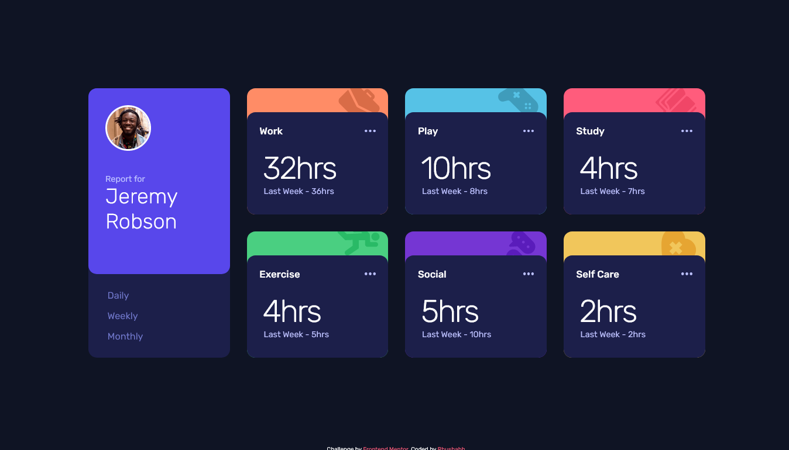

# Frontend Mentor - Time tracking dashboard solution

This is a solution to the [Time tracking dashboard challenge on Frontend Mentor](https://www.frontendmentor.io/challenges/time-tracking-dashboard-UIQ7167Jw). Frontend Mentor challenges help you improve your coding skills by building realistic projects. 

## Table of contents

- [Overview](#overview)
  - [The challenge](#the-challenge)
  - [Screenshot](#screenshot)
  - [Links](#links)
- [My process](#my-process)
  - [Built with](#built-with)
  - [What I learned](#what-i-learned)
  - [Continued development](#continued-development)
- [Author](#author)

**Note: Delete this note and update the table of contents based on what sections you keep.**

## Overview

### The challenge

Users should be able to:

- View the optimal layout for the site depending on their device's screen size
- See hover states for all interactive elements on the page
- Switch between viewing Daily, Weekly, and Monthly stats

### Screenshot



### Links

- Solution URL: [Solution URL](https://www.frontendmentor.io/solutions/responsive-time-tracking-dashboard-7dAAGP15vZ)
- Live Site URL: [Live Site URL](https://rhushabh-time-tracking-dashboard.netlify.app/)

## My process

### Built with

- Semantic HTML5 markup
- CSS custom properties
- Flexbox
- CSS Grid
- Mobile-first workflow
- [Styled Components](https://styled-components.com/) - For styles

### What I learned

```html
<h1>Some HTML code I'm proud of</h1>
```
```css
.proud-of-this-css {
  display: grid;
}
```

### Continued development

To develop this website more, we could add navigation bar and footer with more added elements in the hero section. Looking forward to make the UI more comfortable and easy to access.

## Author

- Frontend Mentor - [@RhushabhPradhan](https://www.frontendmentor.io/profile/RhushabhPradhan)
- Twitter - [@RhushabhPradhan](https://www.twitter.com/RhushabhPradhan)

